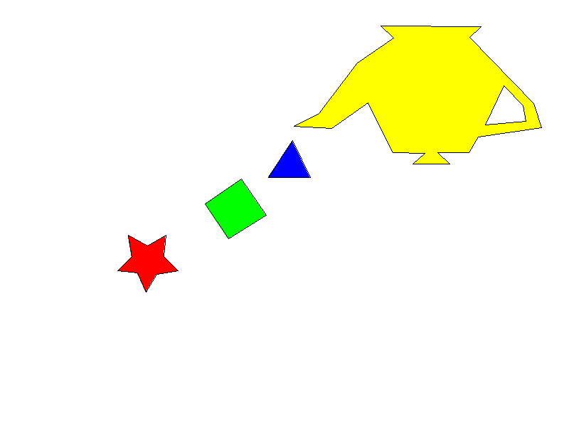

# Rellenado de Polígonos con Rust

Este proyecto implementa un algoritmo de rellenado de polígonos usando Rust y un framebuffer. Se utiliza el algoritmo **Scanline Fill** para rellenar polígonos de más de 4 vértices y se genera una imagen de salida `out.png`.

## Resultado

<p align="center">
  
</p>

## Requisitos

- Rust (versión estable)
- Cargo (viene con Rust)
- Visor de imágenes para abrir `out.png`

## Instalación y ejecución

1. Clona este repositorio:

```bash
git clone https://github.com/Kapiven/PoligonosGP.git
cd poligonos
```

2. instala dependencias
cargo build --release

3. Ejecuta el programa
cargo run --release

4. Abre la el archivo .png para ver el resultado

## Autora
Karen Pineda
